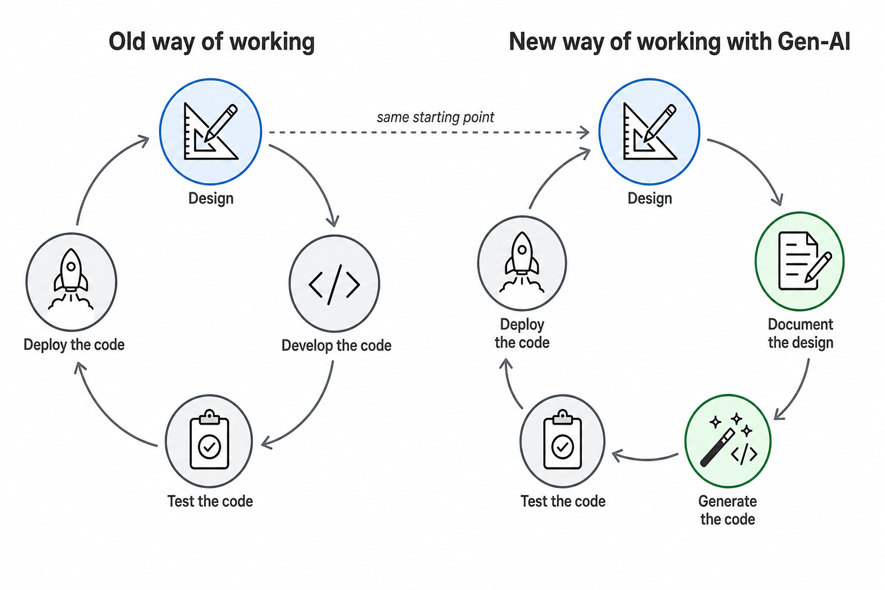
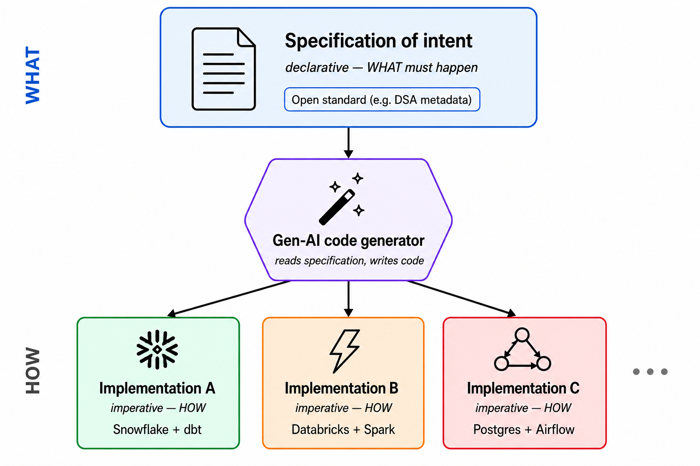

# Data Engineering 2026

## Table of contents

<!-- markdown-toc:start -->
- [Purpose](#purpose)
- [The role of documentation](#the-role-of-documentation)
- [New CI/CD process](#new-cicd-process)
- [Specification of intent](#specification-of-intent)
  - [DSA for defining data transformations](#dsa-for-defining-data-transformations)
  - [Design patterns for specifying intent](#design-patterns-for-specifying-intent)
- [Summary](#summary)
- [Proof of concept](#proof-of-concept)
<!-- markdown-toc:end -->

## Purpose

This project is an exploration of how GenAI improve the data engineering process. GenAI offers a major improvement in efficiency, and potentially also in the overall quality of your data solution.

Let's start by describing a new way of working using GenAI. In my case I use the Cursor 3.4 IDE.

## The role of documentation

Documentation captures design decisions and the knowledge needed to understand the data solution and the data itself. That knowledge is exchanged with other data engineers and with users of the solution.

Traditionally, producing and keeping that material current was labor-intensive work that teams postponed while they focused on getting the data solution running. Architects usually documented the starting architecture well, but detailed design decisions and implementation choices were deferred; under delivery pressure, documentation stayed incomplete or out of date.

Generative AI shifts that balance in two ways:

1. **Easier to produce** — AI can draft and refresh documentation quickly, so maintenance is no longer the bottleneck it was.
2. **Essential for steering AI** — Up-to-date docs become context for the next change; without them, generated code drifts from intent.

**Before:** Documentation lagged behind delivery: strong at kick-off, thin on detail, and often never finished.

**After:** Start every change by updating documentation, then implement. AI drafts the material quickly so you can review intent before code lands. Documentation and release notes can stay current on each pull request, failed approaches can be recorded for the next session, and prior docs feed the next AI session—documentation becomes part of small CI/CD iterations instead of a separate phase.

## New CI/CD process

The CI/CD cycle for a data engineer shifts in two places. **Design** still comes first. What used to be hand-written code becomes generated code, and documentation moves from an afterthought to the input that drives generation.

## Specification of intent

So documentation is the gasoline that fires the GenAI motor. One of the pitfalls when using GenAI is ambiguity or under-specification of your intent: when you vaguely describe what needs to be done, you give GenAI the freedom to generate many different implementations. What GenAI needs is a well-defined specification of your intent in a declarative language—you describe *what* needs to be done, and the code generator produces the code in any desired software stack.

### DSA for defining data transformations

Fortunately there is a well-defined open-source standard to describe source-to-target mappings, data objects, and connections: the [Data Solution Automation (DSA) metadata schema](https://github.com/data-solution-automation-engine/data-warehouse-automation-metadata-schema). The standard describes data transformations in readable JSON files. [Agnostic Data Labs (ADL)](https://docs.agnosticdatalabs.com/docs/) can visualize those files and generate code from Handlebars templates. However, the question is whether to generate this code using this ADL tool or GenAI.

### Design patterns for specifying intent

In [*Data Engine Thinking*](https://dataenginethinking.com/), Roelant Vos and Dirk Lerner describe generic design patterns for building a data solution. Those patterns are a strong way to specify intent: they are technology-agnostic and encode industry best practices. A working collection of such patterns lives in the companion repository [data-engineering-design-patterns](https://github.com/basvdberg/data-engineering-design-patterns).

## Summary 

GenAI demands well-written documentation and a clear, unambiguous specification of intent (*what* needs to be done). Documentation becomes a first-class step in the CI/CD process. Open standards expressed in a declarative language, together with explicit design patterns, are a natural fit for GenAI-driven generation.

## Proof of concept

The [data-solution-2026](https://github.com/basvdberg/data-solution-2026) repository describes a proof of concept that explores the new way of working that is described on this page.

## Project structure

<!-- markdown-project-structure:start -->
- [Data Engineering 2026](readme.md)
  - Docs
- Related repositories
  - [Data Engineering Design Patterns](https://github.com/basvdberg/data-engineering-design-patterns)
  - [Data Solution 2026](https://github.com/basvdberg/data-solution-2026)
<!-- markdown-project-structure:end -->
